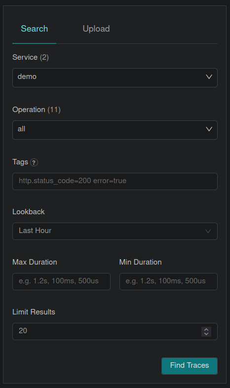

### Demo

#### | Requirements

You need to have [Docker](https://docs.docker.com/get-started/overview/) and [Docker Compose](https://docs.docker.com/compose/) installed.

#### | Four steps

**1.** Install demo dependencies locally:

```sh
yarn install
```

**2.** Launch the [OpenTelemetry Collector](https://opentelemetry.io/docs/collector/) and [Jaeger](https://www.jaegertracing.io/docs/1.46/) in detached mode (i.e., background):

```sh
yarn run docker:upd
```

Go to http://localhost:16686/ so you can visualize the created traces with Jaeger UI.

**3.** Run the demo app:

```sh
yarn run demo
```

Contains three endpoints: [/e1](http://localhost:4000/e1), [/e2](http://localhost:4000/e2) and [/e3](http://localhost:4000/e3). Each one produce a trace. The app runs in the localhost at port 4000.

**4.** You can run the following command to stop the launched services in **2.**:

```sh
yarn run docker:down
```

#### | Jaeger Note

Refresh the page if the `Service` doesn't contain yet the `demo` after you have issued requests to the endpoints.



